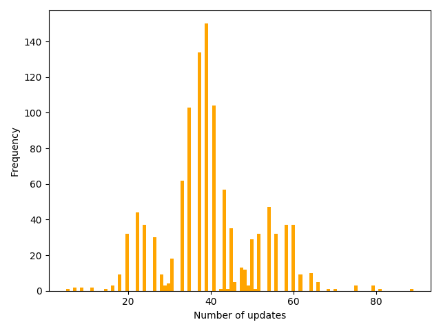
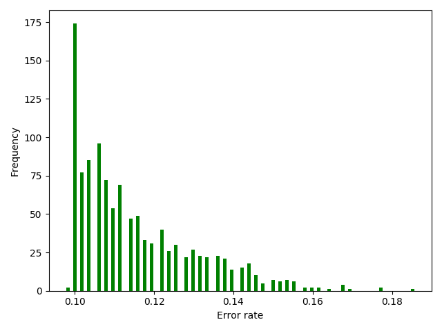
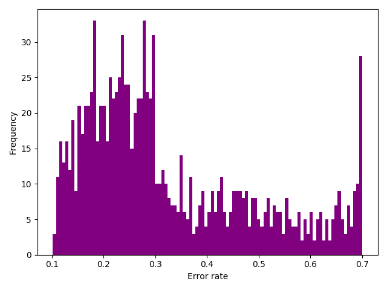

---
puppeteer:
  format: A4
export_on_save:
  puppeteer: true
---

##### B07902055 謝宗晅

#### 1.

#### 2.

音樂串流app的應用：可以透過使用者儲存的曲目或是最近常聽的音樂類型來將音樂庫中的音樂分成兩類，使用者可能喜歡的以及不喜歡的，就可以推薦更多符合使用者喜愛的歌曲給使用者。

#### 3.

根據題目的定義，$E_{OTS}(g, f)$ 只會跟 test input ($\{\text{x}_{N+l}\}_{l = 1}^{L}$) 的資料有關。只看 test input 的部分的話，一共會有 $2^{L}$ 種 $f$，而那些 $f$ 的出現機率也都一樣，都是 ${\frac{1}{2^L}}$。現在我們考慮任意一種 $\mathcal{A}(\mathcal{D})$，我們可以發現對於其中一筆 test input，一定都會有 $\frac{\text{總數}}{2}$ 個 $f$ 是跟我們任意取的 $\mathcal{A}(\mathcal{D})$ 結果不同的 (因為每一種 $f$ 都存在，而且 output 只有 +1 或 -1，因此會剛好有一半的 $f$ 是和 $\mathcal{A}(\mathcal{D})$ 是不同的 output)。因此就能得知所有 test input 的錯誤一共是有這麼多個：
$$L \times \frac{2^L\text{(總數)}}{2}$$
再將 $E_{OTS}$ 和期望值的定義套進去，就能得到
$$\mathbb{E}_f\{E_{OTS}(\mathcal{A}(\mathcal{D}), f)\} = \frac{1}{2^L} \times \frac{1}{L} \times (L \times \frac{2^L}{2}) = \frac 1 2 = \text{constant}$$
Regardless of $\mathcal{A}.$

#### 4.

如果5個骰子都要有綠色的1，那就代表只能選A骰子或是D骰子，計算每一種可能：5個A骰子、4個A骰子和1個D骰子、3個A骰子和2個D骰子...：
$$(\frac 1 4)^5 \times \Sigma_{i = 0}^{5}\text{C}_i^5 = (\frac{1}{4})^5 \times 2^5 = \frac 1 {32}$$

#### 5.

觀察一：發現A和B骰子是不能共存的、C和D骰子是不能共存的，因為A和B都抽到的話就不會有任何一個數字是全部都是綠色的 (C和D同理)。
觀察二："1和3"以及"4和6"可以視為一個數字，因為在每個骰子裡面，他們都會以同樣的顏色出現。
承上題，以下幾種情況的機率都已經知道了：
至少有13是綠色：$\frac 1 {32}$
至少有2是綠色：$\frac 1 {32}$
至少有46是綠色：$\frac 1 {32}$
至少有5是綠色：$\frac 1 {32}$
只要把以上四種情形重複的扣掉，就是答案：
扣掉123都是綠色：$\frac 1 {1024}$
扣掉246都是綠色：$\frac 1 {1024}$
扣掉135都是綠色：$\frac 1 {1024}$
扣掉456都是綠色：$\frac 1 {1024}$
$\Rightarrow 4\times (\frac{1}{32} - \frac{1}{1024}) = \frac{31}{256}$

發現：
"某個數字全都是綠色的"這件事情和上課的"Finite bin version of Hoeffding inequation"其實是很像的東西，只是上課的算法是將每個"壞事"(某個數字全都是綠色的) 發生的機率全部加起來並畫上不等號，但是這樣其實是和實際的情形有落差的：如果只將全部都加起來的話 ($\frac{1}{32} \times 4 = \frac 1 8$)，答案就會和實際相差了 $\frac 1 {256}$。

#### 6.

##### 平均更新次數：40次

#### 7.

##### 平均錯誤率：0.115357

#### 8.

##### 平均錯誤率：0.32455
雖然 $\text{w}_{100}$ 做了比較多更新，但是它的表現有很大的機率是比 $\hat{\text{w}}$ 還差的 (有些錯誤率甚至到了0.7之高)。這代表了在做更新的過程中，每次的更新並不一定是讓 $\text{w}$ 向量往更好的方向靠攏。也就是說 $\text{w}$ 更新越多不一定是表現越好的。

#### Bonus:

##### Ans : 不會成功

##### 原因 :

根據 youtube 影片的 Funtime 部分，我們有：
$$T \leq \frac{R^2}{\rho ^2}$$
其中
$$R^2 = \max_{n} \|\mathbf x_n\|^2,\ \ \ \ \rho = \min_{n} y_n \frac{\mathbf w^\text{T}_\text{f}}{\|\mathbf w _\text{f}\|} \mathbf x _n$$
代入式子可得：
$$T \leq \frac{\max_{n} \|\mathbf x_n\|^2} {(\min_{n} y_n \frac{\mathbf w^\text{T}_\text{f}}{\|\mathbf w _\text{f}\|} \mathbf x _n)^2} = \frac{\max_{n} \|\mathbf x_n\|^2}{\min_{n} \|\mathbf x_n\|^2}$$
因此將每個 $\mathbf x_n$ 乘以 $\frac 1 {10}$ 並不會將 $T$ 變小，因為 $\max_{n} \|\mathbf x_n\|^2$ 和 $\min_{n} \|\mathbf x_n\|^2$都會以同樣的倍率縮小，造成的結果就是 $T$ 的 bound 不會變小。
