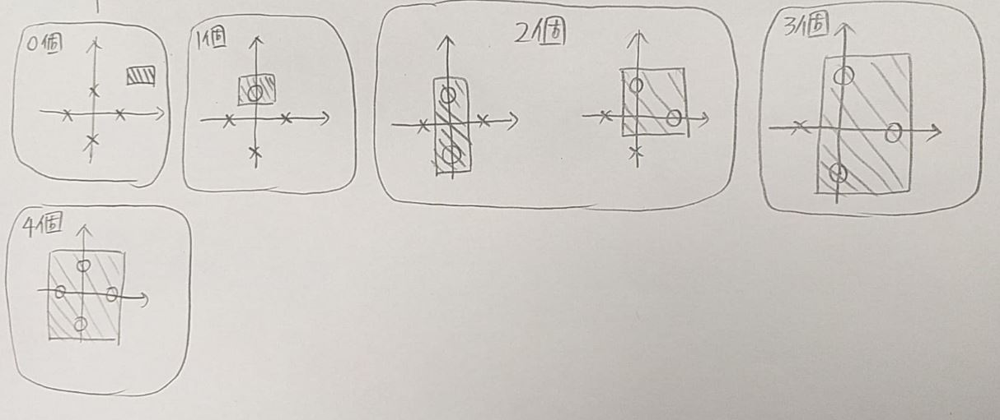
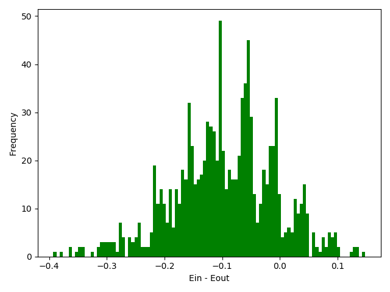
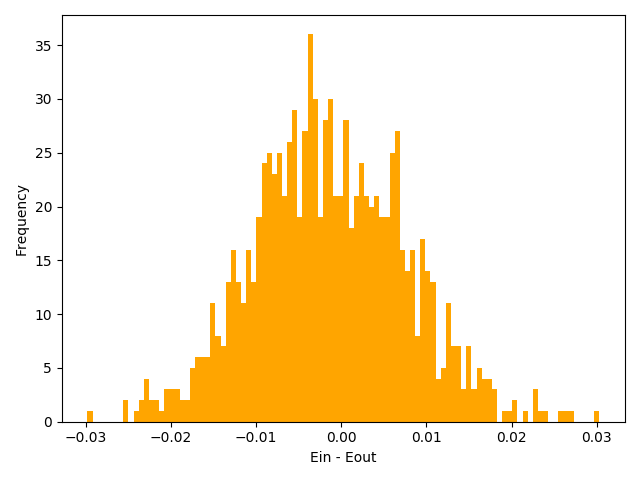

---
puppeteer:
    format: A4
export_on_save:
    puppeteer: true
---

## MLFoundation HW \#2

##### B07902055 謝宗晅

### 1.

### 2.

在二維平面上面有四個點，那些點的位置分別是：
$\{(1, 0), (0, 1), (-1, 0), (0, -1)\}$
對於這筆輸入，我們可以 shatter 每一種可能性，因為任何一種 $+1$ 或 $-1$ 的組合，都可以有方法來達成：
* 0 個 $+1$：把那個長方形畫在很遠的地方
* 1 個 $+1$：畫一個很小的長方形，只罩住需要罩住的點
* 2 個 $+1$：如果是對角的點的組合，就畫一個長長的長方形罩住他們；如果是相鄰的點的組合，就畫一個只罩住他們的長方形
* 3 個 $+1$：把 $-1$ 的點排除在外的長方形就可以達成要求
* 4 個 $+1$：只要有足夠大的長方形就可以把所有點罩住

以下是對上方每個情況的舉例：

由於我們可以 shatter 其中一筆 input，因此我們就可以說該 hypothesis 的 $D_{\text{VC}}$ 不小於 $4$。

### 3.

可以用 4 進位的方式來表示數字，如此的話，對於正數的 "$\text{mod } 4$" 就可以視為只有第一個位數以及小數點後的數字：
Ex：$(6.25)_{10} = (12.1)_{4},\\ (6.25)_{10}\ \text{mod}\ 4 = (2.25)_{10} = (2.1)_{4}$。

觀察 $h_{\alpha}(x)$ 的規律，可以發現如果 $\alpha x \in (3, 4)$ 的話，$h_{\alpha}(x) = +1$；
如果 $\alpha x \in [2,3)$ 的話，$h_{\alpha}(x) = -1$。

而且如果對於 $N$ 筆輸入，我們都可以找到一組 $X = \{x_i ,\ 1 \leq i \leq N \}$，使得 $\mathcal H$ 可以 shatter 這組 $X$ 的話，這個 $\mathcal H$ 的 $d_{vc}$ 就是無限大：
$$X = \bigg\{ x_i\ \bigg|\ x_i = 4^{-2^N} +\sum_{k = 0}^{2^N - 1}4^{-k} (2 + \llbracket \lfloor (k \times 2^{-(i - 1)}) \text{ mod }2\rfloor =1 \rrbracket) \bigg\}$$

( 當 $\alpha = 4^i, i \in \{0, ..., 2^N - 1\}$，每個不同的 $\alpha$ 都會得到不同的 $h(x_i)$ 組合 )

**舉例來說**，當 $N = 2$ 時，$$X = \big\{(2.3231)_4, (2.2331)_4 \big\}$$則當 $\alpha = 4^i, i \in \{0,1,2,3\}$ 的話，$\mathcal H $ 就可以 shatter 這個 $X$：
$\alpha = 1,\ h_1(x_i) = \{-1, -1\}$
$\alpha = 4,\ h_4(x_i) = \{-1, +1\}$
$\alpha = 16,\ h_{16}(x_i) = \{+1, -1\}$
$\alpha = 64,\ h_{64}(x_i) = \{+1, +1\}$
因為對於每個有限的 $N$ 我們都可以做出一組 $X$，因此這個 $\mathcal H$ 的 $d_{vc}$ 是 $\infin$。

PS：關於 $X$ 的說明，其實如果把所有 $x_i$ 直的排列，由右往左寫下來的話，各個位數橫著看就會是代表從 0 到 $2^N - 1$ 的所有數字，因為如果 mod 之後是 2... 的話，那個位數就會做出 -1，如果是 3... 的話，那個位數就會做出 +1，以 $N = 2$ 的例子來說的話，就會長的像是：
2 2  -> 0 ( 0 0 -> -1 -1 )
\-\-\-\- (小數點)
2 3  -> 1 ( 0 1 -> -1 +1 )
3 2  -> 2 ( 1 0 -> +1 -1 )
3 3  -> 3 ( 1 1 -> +1 +1 )
1 1  -> 這個位數是為了保證前面的東西計算之後不會出現 $\text{sign}(0)$ 的特殊情況。

### 4.

反證法：
如果說 $d_{vc}(\mathcal H_1 \cap \mathcal H_2) > d_{vc}(\mathcal H_1)$ 的話，就代表有某個 $K \in \N$ 使得 $(\mathcal H_1 \cap \mathcal H_2)$ 可以 shatter 某 $K$ 筆輸入，而 $\mathcal H_1$ 沒辦法 shatter 任何 $K$ 筆輸入，就得到了 $(\mathcal H_1 \cap \mathcal H_2) \supset \mathcal H_1$。
但因為 $\mathcal H_1 \supseteq (\mathcal H_1 \cap \mathcal H_2)$，因此我們的假設與事實不符。
得證 $d_{vc}(\mathcal H_1 \cap \mathcal H_2) \leq d_{vc}(\mathcal H_1)$。

### 5.

因為$$m_{\mathcal{H}_1\cup\mathcal{H}_2}(N) = m_{\mathcal{H}_1}(N) + m_{\mathcal H _2}(N) - m_{\mathcal H _1 \cap \mathcal{H}_2}(N)$$ 而且
$$m_{\mathcal H _1 \cap \mathcal{H}_2}(N) = 2$$( 因為只有"全部都是 +1" 和 "全部都是 -1" 的 hypothesis 會是他們的交集。)

所以$$m_{\mathcal{H}_1\cup\mathcal{H}_2}(N) = (N + 1) + (N + 1) - 2 = 2N$$
當 $N = 1$ 時，$m_{\mathcal{H}_1\cup\mathcal{H}_2}(1) = 2 = 2^1$；
當 $N = 2$ 時，$m_{\mathcal{H}_1\cup\mathcal{H}_2}(2) = 4 = 2^2$；
當 $N = 3$ 時，$m_{\mathcal{H}_1\cup\mathcal{H}_2}(3) = 6 < 2^3$

因此 $d_{vc}(\mathcal{H}_1\cup\mathcal{H}_2) = 2$

### 6.

考慮以下的幾種情況：
* $s = 1,\ \theta > 0$
    * $h(x)$ 答錯的情況：$h(x) = -1,\ f(x) = +1$
        * 機率：$\frac \theta 2$
    * $h(x)$ 答錯的情況：$h(x) = +1,\ f(x) = -1$
        * 機率：0 ( 這個情況不可能發生 )
* $s = 1,\ \theta < 0$
    * $h(x)$ 答錯的情況：$h(x) = -1,\ f(x) = +1$
        * 機率：0 ( 這個情況不可能發生 )
    * $h(x)$ 答錯的情況：$h(x) = +1,\ f(x) = -1$
        * 機率：$\frac {-\theta} 2$

合併 $s = 1$ 的情況，可以發現在 $\theta$ 外面加上絕對值就可以用一個式子表示：
$\frac {|\theta|} 2 \times \frac 1 2 + \frac {|\theta|} 2 \times \frac 1 2 = \frac {|\theta|} 2$

* $s = -1,\ \theta > 0$
    * $h(x)$ 答錯的情況：$h(x) = -1,\ f(x) = +1$
        * 機率：$\frac 1 2 (1 - \theta)$
    * $h(x)$ 答錯的情況：$h(x) = +1,\ f(x) = -1$
        * 機率：$\frac 1 2$
* $s = -1,\ \theta < 0$
    * $h(x)$ 答錯的情況：$h(x) = -1,\ f(x) = +1$
        * 機率：$\frac 1 2$
    * $h(x)$ 答錯的情況：$h(x) = +1,\ f(x) = -1$
        * 機率：$\frac 1 2(1 - (-\theta))$

同樣的，我們可以在 $\theta$ 外面加上絕對值來合併 $s = -1$ 的結果：
$\frac 1 2(\frac 1 2(1 - |\theta|) + \frac 1 2) + \frac 1 2(\frac 1 2 + \frac 1 2(1 - |\theta|)) = 1 - \frac {|\theta|} 2$

如果要把 $s$ 也加入式子的話，就用以下的表示方式：
$\frac {s + 1} 2[\text{ s = 1 的結果 }] - \frac {s - 1} 2 [\text{ s = -1 的結果 }]$

所以還沒算入 noise 的錯誤率就會是：
$\frac {s + 1} 2(\frac {|\theta|} 2)\ -\ \frac{s - 1} 2(1 - \frac {|\theta|} 2) = \frac {s|\theta|} 2 - \frac s 2 + \frac 1 2$

把 noise 算入的話，錯誤的就只有以下的情況：
* 正確的 $\times$ noise 機率：
    * $(\frac 1 2 - \frac {s|\theta|} 2 + \frac s 2) \times (0.2)$
* 錯誤的 $\times$ (1 - noise 機率)：
    * $(\frac {s|\theta|} 2 - \frac s 2 + \frac 1 2) \times (0.8)$

將以上結果加總的話，就能算出結果：
$$0.1 - 0.1s|\theta|  + 0.1s + 0.4 s|\theta| - 0.4s + 0.4\\ = 0.5 + 0.3s|\theta| - 0.3s$$

### 7.

**Findings**

有超過半數的 $E_{in} - E_{out}$ 結果是負的。因為資料的數量太少了，所以才會造成 $E_{in} - E_{out}$ 的值這麼不均勻。

### 8.

**Findings**

這題的結果，$E_{in} - E_{out}$ 的分布相較於第七題的結果比較均勻，但總體來看，負的還是稍微比正的多一些，應該是因為資料的數量變多了之後，那麼多的 $x_i$ 會使得 $E_{in}$ 更接近我們以 "資料分布完全均勻" 的假設去估計所得的 $E_{out}$。

### 9. Bonus

首先，先證明那個 $\mathcal H$ 的 $d_{vc} \geq 2^d$：
當 $N = 2^d$ 時，我們一定可以找到一種 $\bold t$ 使得每一個點 (每一個 $\bold x$) 都分布在不同的區域裡面，這樣的話只要做出 $2^{2^d}$ 種 $\bold S$，就可以 shatter 了 (如果做出 $2^{2^d}$ 種 output，就可以 shatter 那筆輸入，所以可以 shatter)

再來，再證明那個 $\mathcal H$ 的 $d_{vc} < 2^d + 1$：
考慮 $N = 2^d+1$ 時，我的想法是先從 $N = 2^d$ 的情況開始想，因為被分割的區域最多只有 $2^d$ 個，因此必定會有兩個點位於同一個被分割的區域裡面。所以將新增的點放到"跟恰好一個點一組"的話，一樣可以做出 $2^{2^d}$ 種 output。但是問題來了，如果要將被新增的那個點放在一個固定的位置，使得它有辦法透過改變切法來跟每個點同一組的話，則那個點的位置就必須是在"最中心"的附近。"最中心"的意思是，如果我們將本來的 $2^d$ 個點擺放的整整齊齊，使得某個 $t_1 = t_2 = ... = t_d$ 的這個分割可以把全部的點分到不同的區域的話，那麼"最中心的位置"就是位於 $(t_1,...,t_d)$ 這附近的位置。因為如果新增的點位於那附近的話，就可以讓 $\bold t$ 裡面的某個 $t_i$ 微調一下就可以把新增的點分配到不同的區域。但是如果是位於那附近的話，就有至少一種 output 是那種擺放方法絕對沒辦法 shatter 的：就是新增的點是 +1，而其他 $2^d$ 個點都是 -1，因此沒辦法 shatter $2^d+1$ 筆輸入。
