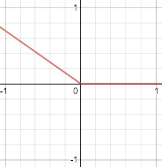
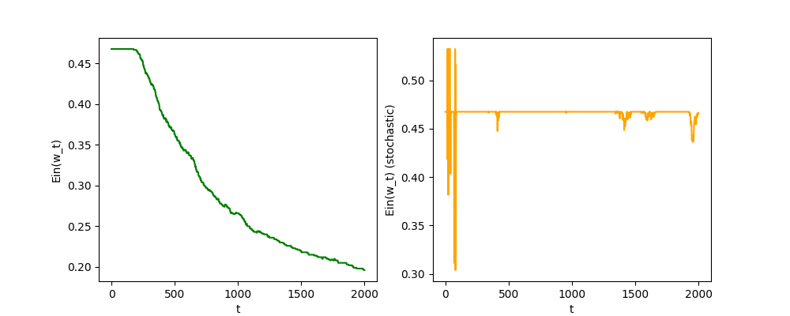
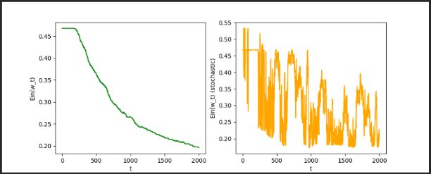
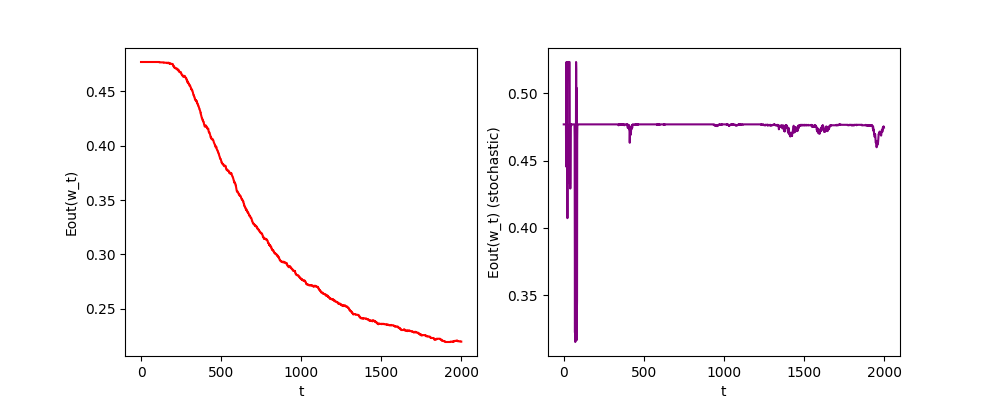

---
puppeteer:
    format: A4
export_on_save:
    puppeteer: true
---

## ML HW\#3

##### B07902055 謝宗晅

### 1.

### 2.

**Prove**
<!-- $\max(0,-y\mathbf w^T\mathbf x)$ 的圖形長的很像這樣：

可以發現當 $\max(0, -y\mathbf w^T\mathbf x) = 0$ 的時候，斜率是 0；
當 $\max(0, -y \mathbf w^T\mathbf x) > 0$ 的時候，對 $\mathbf w$ 的斜率是 $-y\mathbf x$ -->
分成兩個情況來討論，分別是 $y = 1$ 和 $y = -1$ 兩種情況：
* $y = 1$：
    * $\mathbf w^T\mathbf x > 0$
      PLA：正確，所以不用修正 ($\mathbf w_{t+1} = \mathbf w_t$)
      SGD：因為 $\max(0, -y\mathbf w^T\mathbf x) = 0$ 時的梯度 = 0，所以一樣是不用修正 ($\mathbf w_{t+1} = \mathbf w_t$)
    * $\mathbf w^T\mathbf x < 0$
      PLA：錯誤，所以要修正，$\mathbf w_{t+1} = \mathbf w_t + y\mathbf{x}$
      SGD：因為 $\max(0, -y\mathbf w^T\mathbf x) = -y\mathbf w^T\mathbf x$ 時的梯度是 $-y\mathbf x$，所以要修正，$\mathbf w_{t+1} = \mathbf w_t - (-y\mathbf{x}) = \mathbf w_t + y\mathbf{x}$
* $y = -1$
    * $\mathbf w^T\mathbf x < 0$
      PLA：正確，所以不用修正 ($\mathbf w_{t+1} = \mathbf w_t$)
      SGD：因為 $\max(0, -y\mathbf w^T\mathbf x) = 0$ 時的梯度 = 0，所以一樣是不用修正 ($\mathbf w_{t+1} = \mathbf w_t$)
    * $\mathbf w^T\mathbf x > 0$
      PLA：錯誤，所以要修正，$\mathbf w_{t+1} = \mathbf w_t + y\mathbf{x}$
      SGD：因為 $\max(0, -y\mathbf w^T\mathbf x) = -y\mathbf w^T\mathbf x$ 時的梯度是 $-y\mathbf x$，所以要修正，$\mathbf w_{t+1} = \mathbf w_t - (-y\mathbf{x}) = \mathbf w_t + y\mathbf{x}$

因為 SGD 每次也是選取單一個點來更新 $\mathbf w$，因此可以證明以 $err(\mathbf w) = \max(0, -y\mathbf{w}^T\mathbf x)$ 為 error function 的 SGD 做出來的結果會和 PLA 一樣。

### 3.

要最小化 $\hat E_2(\Delta u , \Delta v)$ 的話，就要讓 $\nabla \hat E_2(\Delta u , \Delta v) = 0$。為了方便表示，我將 $(u, v)$ 用 $\mathbf a$ 表示，也就是說 $\hat E_2(u,v) = \hat E_2(\mathbf a)$。因此當 $\mathbf x = (u+\Delta u,v + \Delta v)$ 很靠近 $\mathbf a$ 時 ($\Delta u$ 和 $\Delta v$ 很小)，就可以把式子寫成：$$E(\mathbf x )  \approx \hat E_2(\mathbf x) $$$$= E(\mathbf a) +(\nabla E(\mathbf a))^T(\mathbf x - \mathbf a) + \frac 1 2 (\mathbf x - \mathbf a)^T (H)(\mathbf x - \mathbf a)$$$$= E(\mathbf a) +(\nabla E(\mathbf a))^T(\mathbf x - \mathbf a) + \frac 1 2 (\mathbf x^TH\mathbf x - 2\mathbf a^TH\mathbf x + \mathbf a^TH\mathbf a )$$$$\Rightarrow \nabla \hat E_2(\mathbf x)=H\mathbf x + (\nabla E(a) - H\mathbf a) = 0$$$$\Rightarrow\mathbf x = -(H^{-1})(\nabla E(\mathbf a) - H\mathbf a)$$$$\Rightarrow\Delta \mathbf x = \mathbf x - \mathbf a = -(H^{-1})(\nabla E(\mathbf a))+ (H^{-1})(H\mathbf a) - \mathbf a$$$$ = -(H^{-1})(\nabla E(\mathbf a))$$
因為 Hessian 矩陣是 positive definite 的，因此他的反矩陣必定存在。所以我們要找的 $(\Delta u, \Delta v)$ 就是上方的 $\Delta \mathbf x = -(H^{-1})(\nabla E(\mathbf a))$。

### 4.

和上課的內容是幾乎一樣的，只是要將 target function 想成有 $K$ 個 (雖然實際上只有一個)，其中每一個想像出來的 target function，$f_k(\mathbf x)$，代表的是這組 $\mathbf x$ 被分類到的結果是 $k$ 的機率，所以一組 $\mathbf x$ 是 $k$ 的 likelihood 就可以正比於
$$\prod _{i = 1}^{K}h_i(y_i\mathbf x)$$其中 $y_i\in\{+1, -1\}$，+1 表示 output 是 $i$，-1 表示 output 不是 $i$。所以全部的 $\mathbf x$ 的 likelihood 就會有下列這個式子：
$$\max _h \text{likelihood }(h) \propto \prod _{n=1}^N \Big(\prod _{i=1}^K h_i(y_{i,n}\mathbf x_n)\Big) = \prod _{n=1}^N \Bigg(\prod _{i=1}^K \frac{\exp (y_{i,n}\mathbf w^T_i \mathbf x_n)}{\sum_{k=1}^{K}\exp (y_{i, n}\mathbf w_k^T\mathbf x_n)}\Bigg)$$
再運用課堂上提過的取 $\ln$ 技巧，就會變成：
$$\max _h \ \ \sum_{n=1}^N \Bigg(\sum_{i=1}^K\ln\Bigg(\frac{\exp (y_{i,n}\mathbf w^T_i \mathbf x_n)}{\sum_{k=1}^{K}\exp (y_{i, n}\mathbf w_k^T\mathbf x_n)}\Bigg)\Bigg)$$
加上負號，把前面的 $\max$ 變成 $\min$：
$$\min_h\ \ \sum_{n=1}^N \Bigg(\sum_{i=1}^K\ln\Bigg(\frac{\sum_{k=1}^{K}\exp (y_{i, n}\mathbf w_k^T\mathbf x_n)}{\exp (y_{i,n}\mathbf w^T_i \mathbf x_n)}\Bigg)\Bigg)$$其中，$\ln$ 分母的部分可以分離開來，並且又因為之前的定義，$y_{i, n} = 1$ 若且唯若對於 $\mathbf x_n$ 這筆資料的類別是 $i$，所以：
$$\min_h\ \ \sum_{n=1}^N \Bigg(\ln\Bigg({\sum_{k=1}^{K}\exp (\mathbf w_k^T\mathbf x_n)}\Bigg) - (\mathbf w^T_{y_n} \mathbf x_n)\Bigg)\Bigg)$$
加上常數 $\frac 1 N$：
$$\frac 1 N \sum_{n=1}^N \Bigg(\ln\Bigg({\sum_{k=1}^{K}\exp (\mathbf w_k^T\mathbf x_n)}\Bigg) - (\mathbf w^T_{y_n} \mathbf x_n)\Bigg)\Bigg)$$

### 5.

我們的目標是找到使得梯度為 0 的那個 $\mathbf w$。
題目的式子可以被化成以下這樣子 (參考自 Linear regression 的 slide)：
$$\frac {1}{N+K}\bigg(\Big\|\mathbf {Xw - y}\Big\| ^2 + \Big \| \mathbf {\tilde{X}w-\tilde{y}}\Big \| ^2 \bigg)$$
展開之後得到 (前面的 $\frac 1 {N+K}$ 對於求梯度 = 0 時的 $\mathbf w$ 不會有影響，所以暫時省略)：
$$ \Big(\mathbf{w}^T\mathbf{X}^T\mathbf{Xw} - 2\mathbf{w}^T\mathbf{X}^T\mathbf{y}+\mathbf{y}^T\mathbf{y} \Big) +\Big(\mathbf{w}^T\mathbf{\tilde{X}}^T\mathbf{\tilde{X}w} - 2\mathbf{w}^T\mathbf{\tilde{X}}^T\mathbf{\tilde{y}}+\mathbf{\tilde{y}}^T\mathbf{\tilde{y}} \Big) $$
把上面的式子對於 $\mathbf w$ 偏微分就會變成梯度：
$$\Big(2\mathbf{X}^T\mathbf{Xw} - 2\mathbf {X}^T\mathbf y \Big) + \Big(2\mathbf{\tilde{X}}^T\mathbf{\tilde{X}w} - 2\mathbf {\tilde{X}}^T\mathbf y \Big)$$
因此，當梯度 = 0 的時候，題目的式子就會是最小值，所以：
$$\Big(2\mathbf{X}^T\mathbf{Xw} - 2\mathbf {X}^T\mathbf y \Big) + \Big(2\mathbf{\tilde{X}}^T\mathbf{\tilde{X}w} - 2\mathbf {\tilde{X}}^T\mathbf y \Big) = 0$$$$\Rightarrow \mathbf w = \Big(\mathbf X ^T\mathbf X + \mathbf {\tilde{X}}^T\mathbf {\tilde{X}}\Big)^{-1}\Big(\mathbf {X}^T\mathbf y + \mathbf {\tilde{X}}^T\mathbf {\tilde{y}}\Big)$$

### 6.

由第 5 題的第一個式子：
$$\frac {1}{N+K}\bigg(\Big\|\mathbf {Xw - y}\Big\| ^2 + \Big \| \mathbf {\tilde{X}w-\tilde{y}}\Big \| ^2 \bigg)$$
可以得到令：
$$\mathbf {\tilde X} = \sqrt \lambda\mathbf I,\ \ \mathbf{\tilde y} = \mathbf 0$$
就可以得到：
$$\argmin _{\mathbf w}\ \frac 1 {N+d}\bigg(\Big\|\mathbf {Xw - y}\Big\| ^2 + \Big\|\sqrt\lambda\mathbf {w}\Big\|^2\bigg)$$$$=\argmin _{\mathbf w}\ \frac 1 {N+d}\bigg(\Big\|\mathbf {Xw - y}\Big\| ^2 + \lambda\Big\|\mathbf {w}\Big\|^2\bigg)$$$$\approx\argmin _{\mathbf w}\ \frac \lambda N \big\|\mathbf w\big\|^2 + \frac 1 N \Big\|\mathbf{Xw} - \mathbf y\Big\|^2$$

### 7.

**Findings**
左邊的是用一般的 gradient descent，learning rate = 0.01 畫的圖
右邊的是用 stochastic gradient descent，learning rate = 0.001 畫的圖
可以看到左邊的 $E_{in}(\mathbf w_t)$ 有在下降的趨勢，而且是相當明顯的趨勢，但是右邊的圖看起來幾乎沒有在學習的樣子，我想應該是因為 learning rate 的差距造成了這樣的結果，右邊的圖因為 learning rate 太小了，所以幾乎沒有學習的跡象，而且我也有做了額外的實驗，是將 stochastic gradient descent 的 learning rate 調成 0.01，結果輸出的樣子會是很大的上下起伏，就像是 learning rate = 0.001 時，前 50 次更新的樣子，但是隨著很大的上下起伏，整體的 $E_{in}$ 還是有在逐漸下降的趨勢，就像是下面這樣：

$E_{in}$ 最終還是下降到了接近 0.2 的地方。

### 8.

**Findings**
左邊的是用一般的 gradient descent，learning rate = 0.01 畫的圖
右邊的是用 stochastic gradient descent，learning rate = 0.001 畫的圖
其實 $E_{out}$ 的趨勢和上方的 $E_{in}$ 的趨勢是很接近的，如果不說是哪一張圖的話其實看不太出來哪一張是 $E_{in}$，哪一張是 $E_{out}$，而我也有對於不同的 learning rate 做額外的實驗，和第 7 題一樣，結果也是和第 7 題很接近。

### Bonus

#### (a)

根據題目的定義，我們可以寫出：
$${X}^TX\mathbf w_{\text{lin}} = X^TX\big(V\Gamma^{-1}U^T\mathbf y\big) = X^T\big(U\Gamma V^T\big)\big(V\Gamma ^{-1}U^T\mathbf y\big)$$$$=X^T\big(U\Gamma \Gamma^{-1}U^T\mathbf y\big) = X^T\big(UU^T\mathbf y\big) = X^T\mathbf y$$
因此 $\mathbf w_{\text{lin}} = \big(V\Gamma^{-1}U^T\mathbf y\big)$ 是一個解。

#### (b)

先證明一個小引理：
令 $U$ 是內積空間 $W$ 的子空間，令 $z \in W$，以及 $x\in U$ 和 $$y \in V = U^\perp = \{v \in W\ |\ v\cdot u = 0,\ \forall u \in U\}$$ 使得 $z = x + y$，則 $$\|z\| \geq \|x\|$$
證明：
因為$$\|z\|^2=\|x\|^2+2(x\cdot y)+\|y\|^2=\|x\|^2+\|y\|^2$$
又 $\|y\|\geq 0$，得證。

令一個 subspace $W = \text{span}(\text{col}(X))$，其維度是 $\rho$，且題目中的 $\mathbf w _{\text{lin}} = X^\dagger \mathbf y$，令另外一個 $\mathbf w$ 滿足 $X^TX\mathbf w = X^T\mathbf y$，則將 $\mathbf w$ 垂直投影到 $\text{span}(\text{col}(X^\dagger)) = \text{Null}(\text{col}(X))=W^\perp$ 的結果就會是 $\mathbf w_{\text{lin}}$：
$$X^\dagger X\mathbf w = X^\dagger X\mathbf w_{\text{lin}} = X^\dagger XX^\dagger \mathbf y = X^\dagger \mathbf y = \mathbf w _{\text{lin}}$$
再根據我們的小引理，因此有了 $\|\mathbf w_{\text{lin}}\| \leq \|\mathbf w\|$ 的結論。
